# LightApp — a Lightning wallet that doesn't hide your node

An Android wallet (Kotlin + Jetpack Compose) built on Blockstream
**[Greenlight](https://blockstream.github.io/greenlight/)**. Unlike custodial or
LSP-abstracted wallets, LightApp gives you a **full Core Lightning node** whose
keys live only on your phone: Greenlight runs the node in the cloud, but every
signature is produced on-device by an in-app signer. You get the whole RPC
surface — channels, liquidity, invoices, xpay, on-chain — in
a clean UI, instead of a locked-down "balance and a send button".

## Features

<table>
  <tr>
    <td align="center" width="33%">
      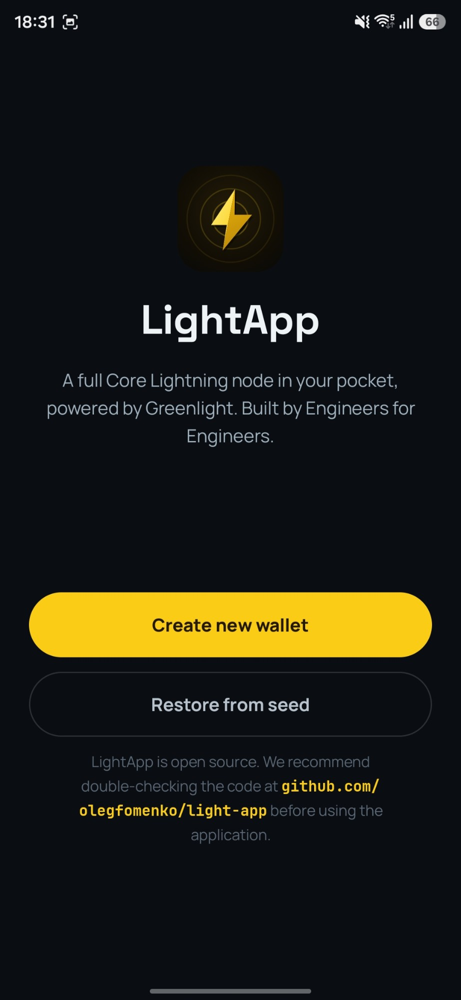<br>
      <b>Onboarding</b><br>
      <sub>Create a 24-word BIP39 wallet or restore from seed — pasting the
      whole phrase fills every word box. Open source, and the app says so up
      front: the welcome screen links straight to this repo.</sub>
    </td>
    <td align="center" width="33%">
      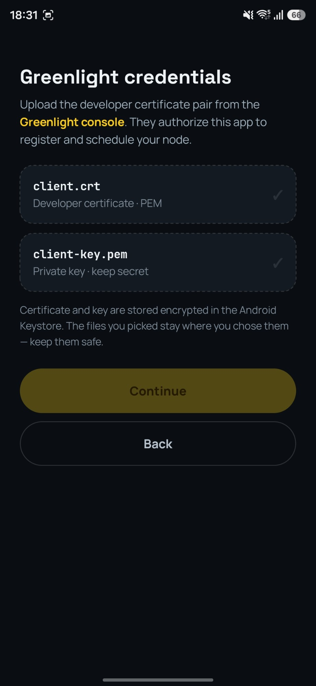<br>
      <b>Greenlight credentials</b><br>
      <sub>Upload the developer certificate pair from the Greenlight console
      (linked in-app). They authorize node registration and scheduling, and
      are stored encrypted via the Android Keystore.</sub>
    </td>
    <td align="center" width="33%">
      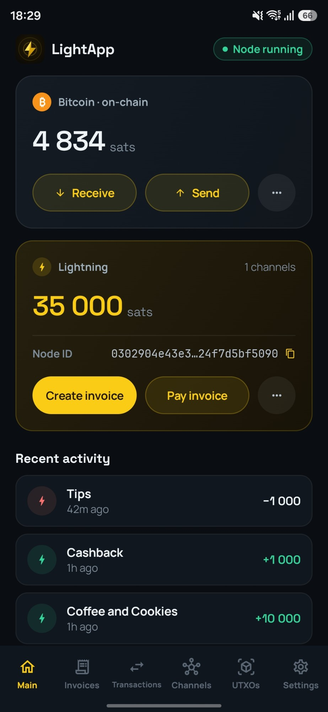<br>
      <b>Main</b><br>
      <sub>On-chain and Lightning balances, live node status, node ID, and
      recent activity — payments, invoices, and transactions, each tappable
      through to its detail. Auto-refreshes every 30&nbsp;s.</sub>
    </td>
  </tr>
  <tr>
    <td align="center">
      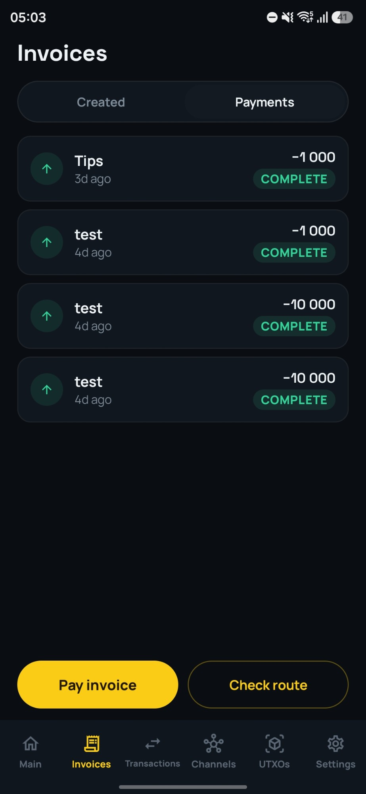<br>
      <b>Invoices &amp; payments</b><br>
      <sub>Created invoices (paid / unpaid / expired) and sent payments,
      labeled by their invoice description. Payments run asynchronously, and
      the Payments segment carries a <b>Check route</b> shortcut for
      dry-running a payment before sending it.</sub>
    </td>
    <td align="center">
      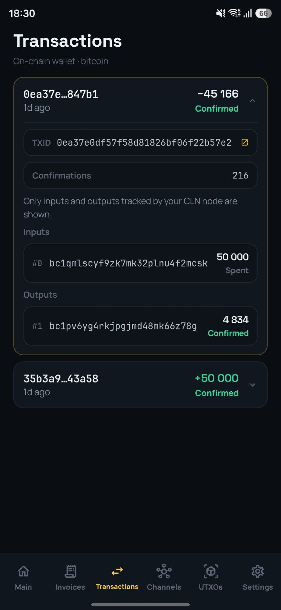<br>
      <b>Transactions</b><br>
      <sub>On-chain history with inline detail: TXID linking out to
      <a href="https://mempool.space">mempool.space</a>, confirmation count,
      and the node-tracked inputs and outputs of each transaction.</sub>
    </td>
    <td align="center">
      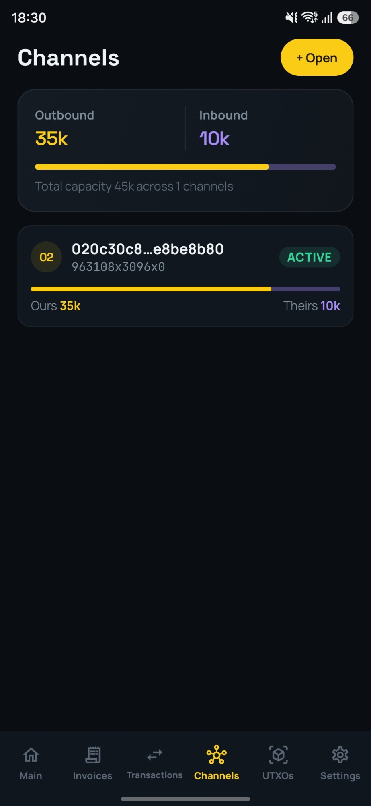<br>
      <b>Channels</b><br>
      <sub>Total outbound / inbound liquidity with per-channel balance bars
      and state. Channel detail exposes reserves, fees, and HTLC limits;
      close from the app.</sub>
    </td>
  </tr>
  <tr>
    <td align="center">
      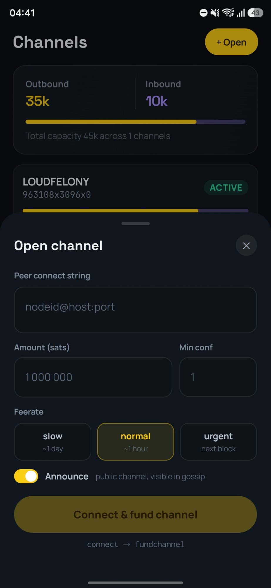<br>
      <b>Open channel</b><br>
      <sub>Peer connect string, amount, min conf, feerate presets and the
      announce toggle — <code>connect</code> then <code>fundchannel</code>
      in one tap.</sub>
    </td>
    <td align="center">
      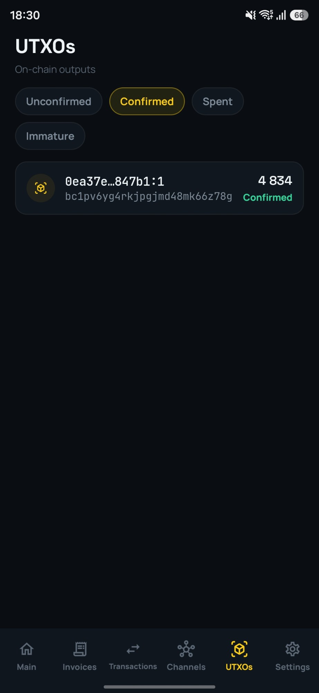<br>
      <b>UTXOs</b><br>
      <sub>Raw coin control view: every output your node tracks, filtered by
      confirmed / unconfirmed / spent / immature, with its address and
      outpoint linking to the explorer.</sub>
    </td>
    <td align="center">
      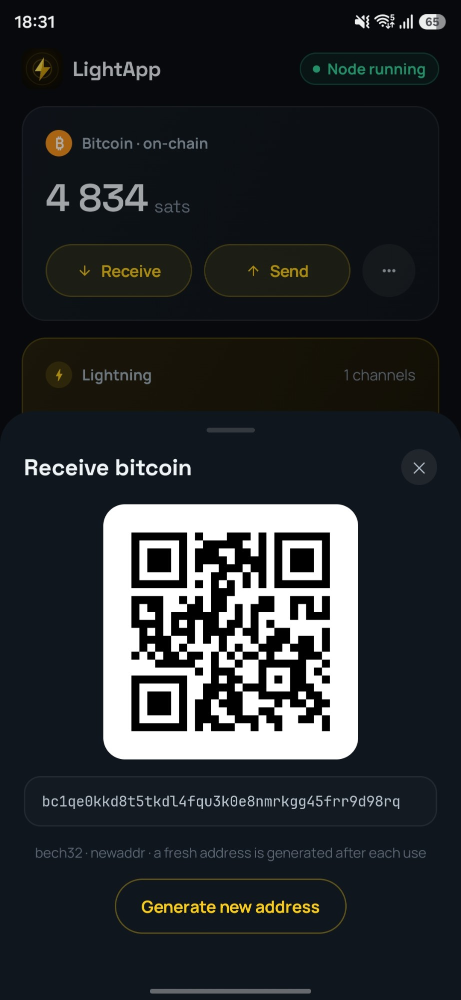<br>
      <b>Receive</b><br>
      <sub>Fresh bech32 address as QR + text (<code>newaddr</code>), with
      one-tap regeneration — a new address after each use.</sub>
    </td>
  </tr>
  <tr>
    <td align="center">
      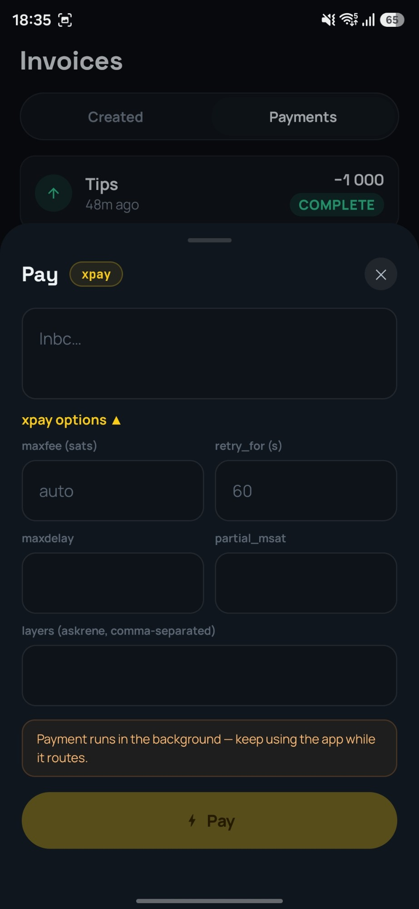<br>
      <b>Pay</b><br>
      <sub>Paste a bolt11 invoice or bolt12 offer, get a decode preview, and
      pay via <b>xpay</b> (multi-part) with the full argument set: maxfee,
      retry_for, maxdelay, partial_msat, askrene layers. Runs in the
      background while you keep using the app.</sub>
    </td>
    <td align="center">
      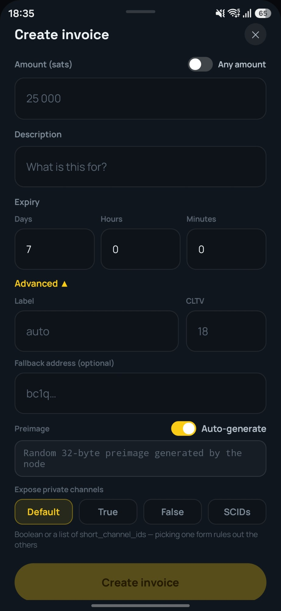<br>
      <b>Create invoice</b><br>
      <sub>Every <code>invoice</code> argument: fixed or any amount,
      description, expiry, label, CLTV, on-chain fallback address, custom or
      auto preimage, and <code>exposeprivatechannels</code>
      (bool or explicit SCIDs).</sub>
    </td>
    <td align="center">
      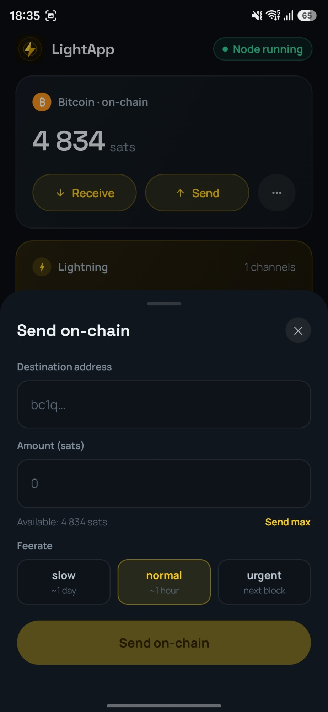<br>
      <b>Send on-chain</b><br>
      <sub><code>withdraw</code> with available balance shown, a Send-max
      option, and slow / normal / urgent feerate presets.</sub>
    </td>
  </tr>
  <tr>
    <td align="center">
      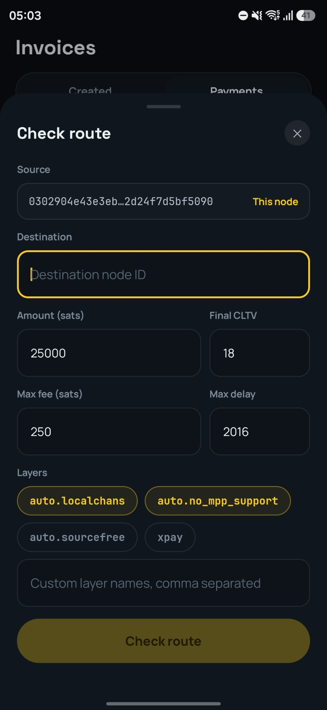<br>
      <b>Check route</b><br>
      <sub>Dry-run a payment with askrene's <code>getroutes</code>: source /
      destination, amount, max fee, CLTV and delay bounds, and route layers
      (<code>auto.localchans</code>, <code>xpay</code>, custom). Returns the
      parts askrene would use, with per-hop fees and success
      probability.</sub>
    </td>
    <td align="center" colspan="2">
      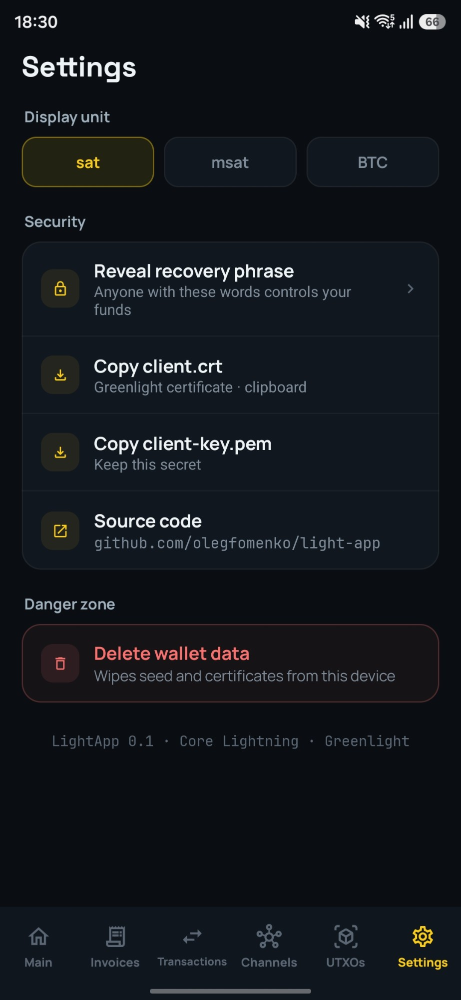<br>
      <b>Settings</b><br>
      <sub>Display unit (sat / msat / BTC), reveal the recovery phrase,
      export the Greenlight certificate and key, a link to this repo, and a
      danger zone that wipes seed and credentials from the device.</sub>
    </td>
  </tr>
</table>

## Architecture

```
core/       Rust crate `lightcore` — wraps Blockstream's gl-client 0.6 and
            exposes a mobile-friendly API over UniFFI. Holds the signer, does
            seed derivation, and maps every CLN RPC to a Kotlin-friendly model.
app/        Android app (package app.light.wallet), Jetpack Compose UI.
scripts/    bootstrap.sh (one-shot host setup + build) and build-rust.sh
            (cross-compiles the .so + regenerates the UniFFI Kotlin bindings).
design/     Snapshot of the reference design (see Design credit below).
```

Data flow: the UI reads shared `StateFlow`s on `WalletRepository`; each Core
Lightning RPC has exactly one flow, so one refresh updates every screen that
shows the data. The Main tab auto-refreshes every 30 s; other tabs refresh on
entry and via pull-to-refresh. The node + signer are released when the app is
backgrounded (unless a payment is dispatching) and re-scheduled on foreground.

## Building

### Requirements

- Android 9 phone or newer with a 64-bit ARM CPU. Only `arm64-v8a` is built.
- MacOS or Linux. Windows works through WSL2, but the setup script is written for macOS.
- Greenlight developer credentials – a certificate and key from Blockstream.
  You do not need them to *build* the app, but you do need them to register a
  node and actually use it. Request them at
  [greenlight.blockstream.com](https://greenlight.blockstream.com/).

### 1. Install Android Studio

Download and install it from
[developer.android.com/studio](https://developer.android.com/studio). It bundles
a JDK and the Android SDK, so you do not need to install Java separately.

### 2. Install Rust

The wallet's core is a Rust library. Install the toolchain from
[rustup.rs](https://rustup.rs):

```bash
curl --proto '=https' --tlsv1.2 -sSf https://sh.rustup.rs | sh
```

Then restart your terminal so `cargo` is on your `PATH`.

### 3. Install protoc

Core Lightning's gRPC bindings are generated at build time and need the protocol
buffer compiler:

```bash
brew install protobuf          # macOS
sudo apt install -y protobuf-compiler   # Debian / Ubuntu
```

### 4. Clone the repository

```bash
git clone https://github.com/olegfomenko/light-app.git
cd light-app
```

### 5. Run the setup & build script

This installs everything else that is missing — the Android NDK, the
`aarch64-linux-android` Rust target, `cargo-ndk` — and then builds the app. It is
safe to re-run and only downloads what you do not already have.

```bash
./scripts/bootstrap.sh --build
```

The first run takes a while, mostly compiling the Rust core and its
dependencies. When it finishes you have an APK at
`app/build/outputs/apk/release/`.

> Linux: the script assumes macOS paths and Homebrew. Install the NDK
> yourself with `sdkmanager "ndk;27.2.12479018"`, then run
> `rustup target add aarch64-linux-android` and `cargo install cargo-ndk`.

### Release signing

Release builds are signed with your own key when `app/keystore.properties`
exists (it is git-ignored):

```properties
storeFile=/absolute/path/to/your-release.jks
storePassword=…
keyAlias=…
keyPassword=…
```

Create the keystore with:

```bash
keytool -genkeypair -v -keystore ~/lightapp-upload.jks \
  -alias upload -keyalg RSA -keysize 4096 -validity 10000
```

Without that file, `assembleRelease` falls back to the public Android debug key
so a locally built APK still installs on your own device. `bundleRelease`, which
produces the Play Store bundle, refuses to build without a real key.

## Security

The wallet's job is to keep your seed on your device and your funds yours.

- **Seed never leaves the device.** Greenlight only ever sees signatures from
  the in-app signer — that is the entire point of Greenlight.
- **At rest:** mnemonic + device credentials + Greenlight cert/key are AES-GCM
  encrypted with an Android Keystore key that is StrongBox-backed where the
  device provides it and **unusable while the device is locked**;
  `allowBackup=false`; secrets are git-ignored.
- **On screen:** seed reveal screens set `FLAG_SECURE` (no screenshots, no
  Recents thumbnail, no screen recording) and are hidden from accessibility
  services.
- **Clipboard:** copying the seed or a private key marks the clip sensitive and
  auto-clears it after 60 s.
- **In memory:** the seed is zeroized in the Rust core after use.
- **Logging:** the Rust/gl-client logs (which contain node/payment metadata) are
  emitted **only on debug builds**.

## Design credit

The visual language is adapted from **"Crypto Wallet App UI Template" by
[DSCODE](https://www.figma.com/community/file/1540673463269508643)** (Figma
Community). `design/lightning-wallet.dc.html` is a local snapshot of the
LightApp-specific design. Fonts (Manrope, Space Grotesk, JetBrains Mono) are
bundled under `app/src/main/res/font/`.

## Contributing

Issues and PRs welcome. Keep the security properties above intact — anything
touching the seed, the Keystore, clipboard, `FLAG_SECURE`, or the payment state
machine deserves extra scrutiny in review.

## License

[MIT](LICENSE). The visual design is adapted from the DSCODE template credited
above, which carries its own Figma Community terms.
